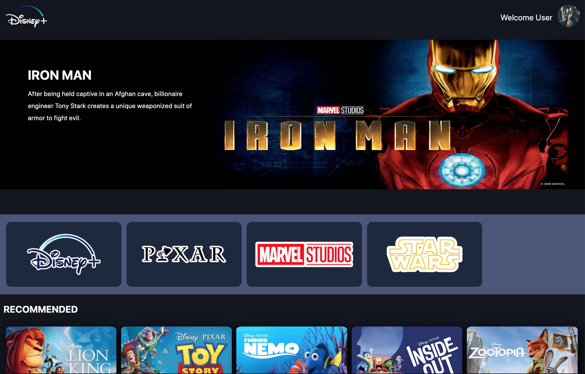

# Disney+ Clone

#### A Disney+ clone created using TypeScript, React, GraphQL, & GraphCMS/Hygraph

##  Deployed Link
[Disney+ Clone](https://disney-clone-e4006.web.app/)

## Table of Contents
- [Deployed Link](#deployment)
- [Technologies Used](#technologiesused)
- [Features](#features)
- [Resources](#resources)
- [Future Implementations](#futureimplementations)

##  Technologies Used
- TypeScript
- React.js
- GraphQL
- GraphCMS/Hygraph
- HTML
- CSS
- React-Bootstrap

##  Features
- Users are recommended movies based on view history
- After viewing a movie, they will be removed from recommended list
- Movies are sorted by genre and franchise

##  Resources:
- [MDN](https://developer.mozilla.org/en-US/)
- [StackOverflow](https://stackoverflow.com/)
- [TypeScript](https://www.typescriptlang.org/docs/)
- [React](https://reactjs.org/docs/getting-started.html)
- [GraphQL](https://graphql.org/)
- [GraphCMS/Hygraph](https://hygraph.com/)

##  Future Implementations:
- Create user profiles
- Authentication
